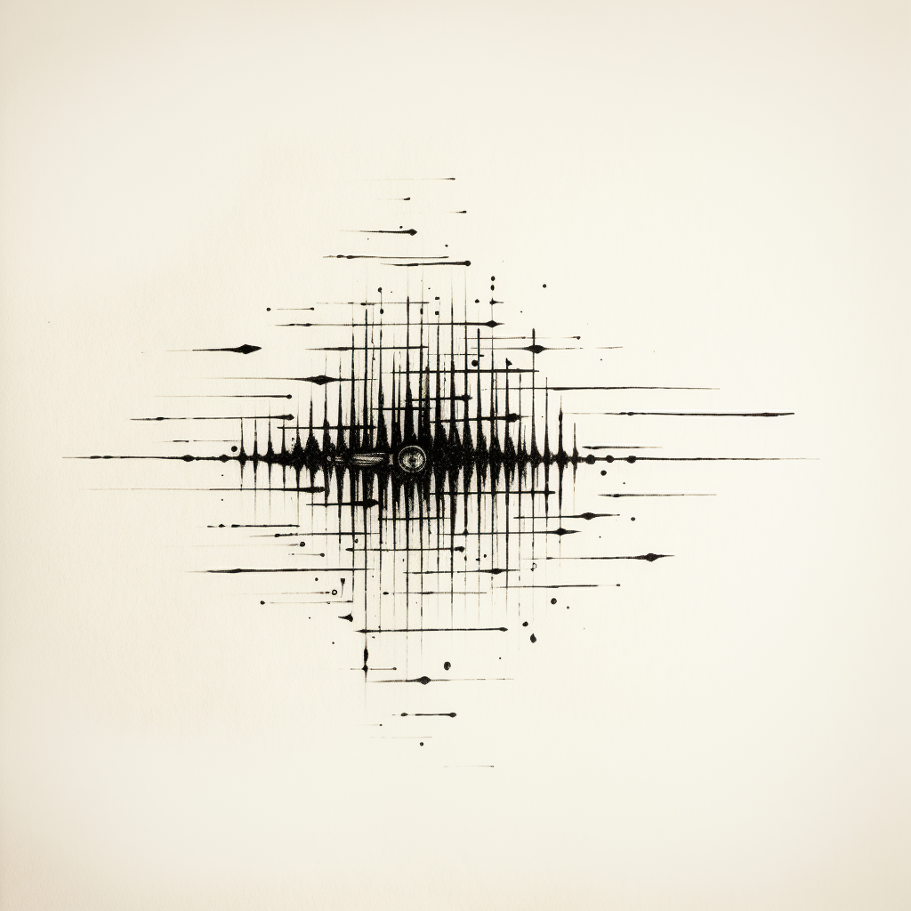

# audiodsp

This repository explores digital signal processing of audio data.

# Introduction to Audio Signal Processing
Audio signal processing is the field of study that focuses on the analysis, manipulation, and synthesis of audio signals. It involves various techniques and algorithms to process and enhance audio signals, enabling us to improve audio quality, remove noise, extract information, and create special effects. Here's an outline of the key topics you would typically cover in an introductory course on audio signal processing:

## Audio Signals:
Topics:
 - Definition of audio signals and their characteristics
 - Analog and digital representations of audio signals
 - Sampling theorem and the Nyquist-Shannon sampling theorem
 - Basic concepts of audio digitization and quantization
   

Audio signals are electrical representations of sound waves that can be perceived by the human ear. They are characterized by various properties, including amplitude, frequency, and phase. Amplitude refers to the strength or intensity of the sound wave, which determines its volume or loudness. Frequency represents the rate at which the sound wave oscillates and determines the pitch or perceived musical note. Phase refers to the relative timing or position of the sound wave at a given point in time. Audio signals can be produced by various sources such as musical instruments, human voices, or electronic devices. Understanding the characteristics of audio signals is fundamental to audio signal processing as it enables us to analyze, manipulate, and synthesize these signals to achieve desired outcomes.

In audio signal processing, audio signals are commonly represented in both analog and digital formats. Analog representation involves capturing the continuous variation of sound waves using analog devices such as microphones or magnetic tape recorders. These devices convert sound waves into electrical signals that resemble the original waveform. On the other hand, digital representation involves converting analog audio signals into a discrete sequence of numbers. This process, known as digitization, involves two essential steps: sampling and quantization. Sampling refers to the process of measuring the amplitude of an analog audio signal at regular intervals in time. The Nyquist-Shannon sampling theorem states that in order to accurately reconstruct the original signal, the sampling rate should be at least twice the highest frequency component present in the signal. Quantization involves approximating the continuous amplitude values of the sampled signal into a finite set of discrete values, usually represented by binary numbers. This digital representation allows for efficient storage, processing, and transmission of audio signals using digital systems and algorithms.

## Time-Domain Analysis:
Topics:
- Time-domain representation of audio signals
- Amplitude, frequency, and phase of audio signals
- Continuous and discrete-time signals
- Discrete-time representation of audio signals using sequences

Time-domain analysis involves examining audio signals in the time dimension, which provides insights into the variations of the signal over time. In the time-domain representation of audio signals, the amplitude of the signal is plotted against time, resulting in a waveform. The waveform visually displays the changes in air pressure or voltage corresponding to the audio signal. By analyzing the waveform, we can observe characteristics such as the duration, intensity, and envelope of the audio signal. This information is crucial for understanding the temporal aspects of audio, including the attack and decay of musical notes or the patterns in speech.

In addition to amplitude, audio signals exhibit properties such as frequency and phase. Frequency represents the rate at which a sound wave oscillates and is measured in Hertz (Hz). It determines the perceived pitch of the audio signal, where higher frequencies correspond to higher pitches. Phase, on the other hand, refers to the relative timing or position of the audio signal at a given point in time. It describes the alignment or offset of the waveform with respect to a reference point. Understanding the amplitude, frequency, and phase characteristics of audio signals is essential for tasks such as equalization, filtering, and manipulation of the audio in both time and frequency domains.

Audio signals can be classified into continuous-time and discrete-time signals. Continuous-time signals are defined and exist for all points in time, such as signals captured by analog recording devices. On the other hand, discrete-time signals are obtained by sampling continuous-time signals at discrete time points. The process of converting a continuous-time signal into a discrete-time signal involves taking samples of the continuous waveform at regular intervals. This sampling is done based on the Nyquist-Shannon sampling theorem, ensuring that the sampling rate is at least twice the highest frequency component in the signal to avoid loss of information. The resulting discrete-time signal can be represented as a sequence of values that can be processed, analyzed, and stored digitally.

In summary, time-domain analysis involves examining the characteristics of audio signals in the time dimension. This includes representing audio signals as waveforms, analyzing the amplitude, frequency, and phase properties, as well as distinguishing between continuous-time and discrete-time signals. By understanding these concepts, we can gain insights into the temporal aspects of audio signals and apply various techniques for processing and manipulating them to achieve desired outcomes.

## Frequency-Domain Analysis:
Topics:
- Fourier series representation of periodic signals
- Fourier transform and its properties
- Discrete Fourier transform (DFT) and its applications
- Fast Fourier transform (FFT) algorithm

Frequency-domain analysis is a fundamental aspect of audio signal processing that allows us to examine audio signals in terms of their frequency content. Fourier series representation is one of the key concepts in frequency-domain analysis, particularly for periodic signals. It states that any periodic signal can be decomposed into a sum of sinusoidal components, each with a specific frequency, amplitude, and phase. The Fourier series provides a way to analyze and understand the frequency content of periodic audio signals, enabling us to identify and manipulate individual harmonics or spectral components that contribute to the overall sound.

The Fourier transform is a generalization of the Fourier series that extends the analysis to non-periodic signals. It transforms a time-domain signal into its frequency-domain representation, revealing the distribution of frequencies present in the signal. The Fourier transform provides valuable information such as the magnitude and phase of different frequency components. It is widely used in audio signal processing for tasks like spectrum analysis, filtering, and synthesis. The Fourier transform has several important properties, including linearity, time shifting, frequency shifting, and convolution, which allow us to manipulate and combine signals in the frequency domain.

For digital signals, the Discrete Fourier Transform (DFT) is commonly used. The DFT computes the Fourier transform of a discrete-time signal, which is sampled at a finite number of points. The DFT provides a discrete spectrum of the signal, representing its frequency content in a discrete set of frequency bins. It is particularly useful for analyzing and processing digital audio signals in a computationally efficient manner. The DFT has applications in audio coding, audio effects, and spectral analysis, among others. To accelerate the computation of the DFT, the Fast Fourier Transform (FFT) algorithm is often employed. The FFT is an efficient algorithm that exploits the symmetry and periodicity properties of the DFT to dramatically reduce the computational complexity, making real-time audio processing feasible.

In summary, frequency-domain analysis allows us to analyze the frequency content of audio signals. The Fourier series enables us to represent periodic signals in terms of their sinusoidal components, while the Fourier transform extends this analysis to non-periodic signals. The DFT provides a discrete spectrum of a digital signal, and the FFT algorithm offers a computationally efficient way to compute the DFT. These tools and techniques are fundamental to understanding the frequency characteristics of audio signals and are widely used in various audio signal processing applications.

## Digital Filters:
Topics:
- Introduction to filters and their applications in audio processing
- FIR (Finite Impulse Response) filters
- IIR (Infinite Impulse Response) filters
- Designing and implementing digital filters
- Filter characteristics, such as frequency response, impulse response, and phase response

Filters play a crucial role in audio signal processing by allowing us to modify the frequency content of audio signals. They are used to enhance desired frequencies, suppress unwanted frequencies, or create specific audio effects. Filters can be analog or digital, but in the context of audio processing, digital filters are commonly employed. Digital filters process discrete-time signals and can be implemented using software or hardware algorithms. There are two primary types of digital filters: Finite Impulse Response (FIR) filters and Infinite Impulse Response (IIR) filters. FIR filters have a finite-duration impulse response, which means that the output of the filter is solely determined by a finite number of input samples. IIR filters, on the other hand, have an impulse response that extends indefinitely into the past, making their output dependent on both current and past input samples. Each type of filter has its own advantages and characteristics, making them suitable for different applications in audio processing.

Designing and implementing digital filters is a key aspect of audio signal processing. The design process involves determining the filter's specifications, such as the desired frequency response, filter order, and filter type (e.g., low-pass, high-pass, bandpass, etc.). Various design methods are available, including windowing, frequency sampling, and optimization techniques like least squares or elliptic approximation. Once the filter design is completed, the implementation stage involves realizing the filter in software or hardware. Software implementations use algorithms to compute the filter's output based on the input samples, while hardware implementations employ digital signal processors (DSPs) or dedicated hardware circuits to perform the filtering operations efficiently. The characteristics of digital filters are crucial for understanding their behavior. The frequency response of a filter describes how it modifies the amplitude and phase of different frequency components in the signal. The impulse response represents the output of the filter when a unit impulse is given as input, providing insights into the filter's temporal behavior. The phase response characterizes the phase shift introduced by the filter at different frequencies. Understanding these filter characteristics allows for precise control and manipulation of audio signals to achieve the desired audio processing goals.

In summary, digital filters are essential tools in audio signal processing for modifying the frequency content of audio signals. FIR and IIR filters are the two primary types of digital filters, each with its own characteristics and applications. Designing and implementing digital filters involve determining the filter specifications and employing various design methods. The characteristics of filters, such as frequency response, impulse response, and phase response, provide insights into their behavior and enable precise control over audio signals. Mastering the design and implementation of digital filters empowers audio signal processors to shape the spectral content of audio and achieve desired audio effects and enhancements.

## Audio Effects:
Topics:
- Equalization: basic concepts and types of equalizers (parametric, graphic, etc.)
- Echo and reverberation effects
- Pitch shifting and time stretching
- Audio modulation techniques (ring modulation, flanging, chorus, etc.)
- Spatial audio processing (panning, surround sound, binaural audio)

Audio effects play a vital role in audio signal processing as they allow us to manipulate and enhance audio signals to achieve specific artistic or technical goals. Equalization is a fundamental audio effect that involves modifying the frequency balance of an audio signal. It enables us to boost or attenuate specific frequency ranges, allowing for tonal shaping and correction. Equalizers come in various types, including parametric equalizers, graphic equalizers, and shelving equalizers, each offering different control and flexibility over the audio spectrum. Echo and reverberation effects create a sense of spaciousness and ambience in audio by simulating the reflections and reverberations typically heard in various acoustic environments. These effects are widely used in music production, sound design, and audio post-production to add depth and realism to recordings.

Pitch shifting and time stretching are audio effects used to alter the perceived pitch and duration of audio signals, respectively. Pitch shifting allows us to raise or lower the pitch of an audio signal without affecting its tempo, enabling creative applications such as harmonization or creating special vocal effects. Time stretching, on the other hand, alters the duration of an audio signal without changing its pitch. It can be used to adjust the tempo of a music track or to create interesting time-based effects. Audio modulation techniques introduce variations to the audio signal to create unique timbral and spatial effects. Ring modulation combines two audio signals to produce sum and difference frequencies, resulting in metallic and bell-like sounds. Flanging creates a sweeping "whooshing" effect by introducing a slight time delay and continuously varying it. Chorus effect adds depth and richness to audio by combining multiple copies of the signal with slight pitch and time variations. These modulation effects are widely used in music production, synthesizers, and sound design to create unique and expressive sounds.

Spatial audio processing involves manipulating the perception of sound location and spatial attributes. Panning is a common technique used to position audio sources in the stereo sound field by adjusting the balance between the left and right channels. Surround sound techniques extend this concept to multiple speakers, creating an immersive audio experience in movies, gaming, and virtual reality applications. Binaural audio aims to recreate a three-dimensional sound experience using headphones by simulating the way sound interacts with the human ears and head. It provides a sense of audio localization and can enhance the realism of audio content. Spatial audio processing techniques are employed in audio production, gaming, virtual reality, and augmented reality to create an engaging and immersive audio environment.

In summary, audio effects are powerful tools that allow for creative and technical manipulation of audio signals. Equalization enables frequency shaping, while echo and reverberation effects add ambience and depth. Pitch shifting and time stretching alter pitch and duration, while audio modulation techniques introduce variations to create unique timbral effects. Spatial audio processing techniques manipulate sound location and spatial attributes to provide an immersive audio experience. Understanding and utilizing these audio effects open up a wide range of possibilities for music production, sound design, and audio post-production, enabling artists and engineers to shape and enhance audio in captivating ways.

## Audio Coding and Compression:
Topics:
- Principles of audio coding and compression
- Lossless and lossy compression algorithms
- Audio codecs (MP3, AAC, FLAC, etc.)
- Psychoacoustic models and perceptual coding

Audio coding and compression techniques are crucial for efficient storage and transmission of audio signals while maintaining acceptable audio quality. The principles of audio coding and compression involve reducing the amount of data required to represent an audio signal by exploiting redundancies and perceptual limitations of human hearing. Compression algorithms can be broadly categorized into two types: lossless and lossy. Lossless compression algorithms aim to reduce the file size of an audio signal without any loss of information. They achieve this by exploiting statistical properties and patterns within the audio data. Lossy compression algorithms, on the other hand, achieve higher compression ratios by removing perceptually less important information from the audio signal. This trade-off between compression ratio and audio quality is achieved through the application of psychoacoustic models and perceptual coding techniques.

Various audio codecs have been developed to implement audio coding and compression algorithms effectively. Common audio codecs include MP3, AAC, and FLAC. MP3 (MPEG-1 Audio Layer III) is a widely used audio codec that employs perceptual coding to achieve high compression ratios while maintaining acceptable audio quality. AAC (Advanced Audio Coding) is a successor to MP3 and offers improved compression efficiency and audio quality. FLAC (Free Lossless Audio Codec) is a lossless audio codec that allows for bit-perfect preservation of the original audio signal. These codecs employ a combination of techniques such as psychoacoustic modeling, transform coding, quantization, entropy coding, and bit-rate control to achieve optimal compression while considering the trade-off between compression ratio and audio quality. They have become standard formats for audio distribution and playback across various devices and platforms.

Psychoacoustic models play a crucial role in audio coding and compression. These models take into account the characteristics of human hearing and the perceptual limitations of the auditory system. By analyzing the properties of audio signals in the frequency domain and considering psychoacoustic phenomena such as auditory masking and temporal masking, psychoacoustic models can identify the perceptually significant components of an audio signal. Perceptual coding techniques leverage these models to allocate fewer bits to less perceptually important components, resulting in higher compression ratios while maintaining perceived audio quality. The application of psychoacoustic models and perceptual coding is a key factor in achieving efficient audio compression without significant perceptual degradation, making it possible to store and transmit audio files in a compressed format while preserving the essential perceptual attributes.

In summary, audio coding and compression techniques aim to reduce the data size of audio signals while maintaining acceptable audio quality. Lossless and lossy compression algorithms achieve this through different approaches, with lossy compression employing psychoacoustic models and perceptual coding techniques to remove less perceptually significant information. Various audio codecs such as MP3, AAC, and FLAC implement these compression algorithms, offering different trade-offs between compression ratio and audio quality. Psychoacoustic models play a vital role in identifying perceptually significant components, enabling efficient compression without significant perceptual degradation. These audio coding and compression techniques have revolutionized audio distribution and playback, enabling efficient storage, streaming, and transmission of audio content across a wide range of devices and platforms.

## Audio Restoration and Enhancement:
- Noise reduction techniques (adaptive filters, spectral subtraction, etc.)
- De-clicking, de-noising, and de-clipping methods
- Dynamic range compression and expansion
- Speech enhancement algorithms

Audio restoration and enhancement techniques aim to improve the quality and intelligibility of audio recordings by reducing unwanted artifacts, enhancing desired signals, and restoring damaged or degraded audio. Noise reduction techniques play a crucial role in audio restoration by minimizing various types of noise, such as background noise, tape hiss, or electrical interference. Adaptive filters are commonly used for noise reduction, where the filter parameters are continuously adjusted to adapt to the changing noise characteristics. Spectral subtraction is another popular method that estimates the noise spectrum and subtracts it from the original signal. These techniques effectively reduce noise while preserving the integrity of the desired audio content.

In addition to noise reduction, audio restoration involves addressing specific audio artifacts. De-clicking techniques are employed to remove abrupt and short-duration clicks or pops caused by vinyl records, digital errors, or microphone handling noise. De-noising methods target continuous and stationary noise, such as steady background noise, hum, or air conditioning noise, to improve the overall audio quality. De-clipping techniques are used to repair distorted audio signals that have been clipped or overdriven, often caused by recording at too high levels. These restoration methods employ algorithms to detect and reconstruct the clipped or distorted portions, restoring the original audio dynamics.

Dynamic range compression and expansion are audio enhancement techniques used to manipulate the dynamic range of an audio signal. Dynamic range compression reduces the difference between the loudest and softest parts of a signal, resulting in a more consistent and controlled volume level. This technique is commonly used in music production to increase perceived loudness, balance levels, and add impact. On the other hand, dynamic range expansion increases the difference between the quietest and loudest parts of a signal, enhancing the perceived detail and clarity. It is often employed in audio post-production and broadcasting to bring out subtle audio nuances and improve intelligibility.

Speech enhancement algorithms focus on improving the intelligibility and clarity of speech in audio recordings. These algorithms employ various techniques such as noise reduction, dereverberation, and enhancement of speech-specific characteristics. By reducing background noise, suppressing reverberation, and emphasizing speech patterns, speech enhancement algorithms enhance speech quality, making it easier to understand in challenging acoustic environments. These techniques find applications in teleconferencing, voice recordings, voice assistants, and speech recognition systems, improving overall communication and speech-based applications.

In summary, audio restoration and enhancement techniques aim to improve the quality, intelligibility, and overall listening experience of audio recordings. Noise reduction techniques effectively remove unwanted noise, de-clicking, de-noising, and de-clipping methods address specific audio artifacts, and dynamic range compression and expansion manipulate the audio dynamics. Speech enhancement algorithms focus on improving speech clarity and intelligibility. These techniques and algorithms are valuable tools in audio restoration, music production, broadcasting, and other applications where enhancing and optimizing audio quality is crucial.

## Audio Synthesis and Sound Design:
Topics:
- Introduction to audio synthesis techniques
- Additive, subtractive, and granular synthesis
- Physical modeling synthesis
- Sound design principles for creating virtual instruments and sound effects
  
Audio synthesis is the process of creating sound electronically using various techniques and algorithms. It plays a central role in sound design, music production, and the development of virtual instruments. Introduction to audio synthesis techniques provides an overview of different approaches to generate sound artificially. Additive synthesis involves combining multiple sine waves or harmonic partials to create complex timbres. It allows for precise control over the individual harmonic content and can produce a wide range of sounds, from musical instruments to novel textures. Subtractive synthesis, on the other hand, starts with a rich waveform and then filters out specific frequencies to shape the desired sound. It is commonly used in analog synthesizers and can create warm and evolving sounds. Granular synthesis operates by manipulating small audio grains, short snippets of sound, to create intricate textures and evolving sonic landscapes. This technique is particularly useful for creating ambient soundscapes and experimental audio effects.

Physical modeling synthesis is an approach that emulates the physical properties and behavior of acoustic instruments or sound-producing objects. It simulates the vibrations, resonances, and interactions that occur in real-world instruments. By modeling the physics of the instrument, physical modeling synthesis can accurately reproduce the unique timbres and expressive qualities of acoustic instruments such as pianos, guitars, and flutes. It allows for real-time control over parameters like plucking or bowing intensity, breath pressure, and other performance-related aspects. Sound design principles for creating virtual instruments and sound effects involve applying various synthesis techniques and processing tools to design and manipulate sounds for specific purposes. It includes considerations of timbre, envelope shaping, modulation, effects processing, and spatial positioning. By understanding sound design principles, audio designers can create virtual instruments that emulate real-world counterparts, as well as craft unique and evocative sound effects for multimedia applications, film, and games.

In summary, audio synthesis and sound design encompass a range of techniques for creating and manipulating sound electronically. Additive, subtractive, and granular synthesis techniques offer different approaches to generating and shaping sound, providing versatility and flexibility in sound creation. Physical modeling synthesis replicates the behavior of acoustic instruments, allowing for realistic and expressive virtual instrument design. Sound design principles encompass the artistic and technical considerations involved in creating virtual instruments and sound effects, including timbre, modulation, effects processing, and spatial placement. By understanding these techniques and principles, sound designers and musicians can craft immersive soundscapes, expressive instruments, and captivating sound effects to enhance various creative projects.

## Real-time Audio Processing:
Topics:
- Introduction to real-time audio processing systems
- Audio interfaces and data streaming
- Buffering and latency issues
- Software and hardware platforms for real-time audio processing
  
Real-time audio processing involves the analysis, manipulation, and synthesis of audio signals in a time-critical manner, typically with imperceptible delays. Real-time audio processing systems are designed to process audio in real-time, meaning that the input audio is processed and the output is generated with minimal latency, allowing for immediate feedback and interaction. These systems are employed in various applications, such as live sound reinforcement, music performance, virtual reality, and interactive multimedia. Real-time audio processing requires specialized algorithms and hardware or software platforms that can handle the processing demands within strict time constraints.

Audio interfaces and data streaming are integral components of real-time audio processing systems. Audio interfaces serve as the bridge between the analog or digital audio signals and the processing system. They provide analog-to-digital and digital-to-analog conversion, allowing the audio signals to be captured and played back by the system. Audio interfaces may also include additional features such as microphone preamplifiers, line inputs and outputs, and MIDI connectivity. Data streaming refers to the continuous and uninterrupted transfer of audio data between the audio interface and the processing system. This data streaming needs to be reliable and fast enough to accommodate the real-time processing requirements. Various protocols and interfaces, such as USB, Thunderbolt, and Ethernet, are commonly used for efficient and high-speed audio data streaming.

Buffering and latency issues are important considerations in real-time audio processing. Buffers are temporary storage areas used to hold audio data as it flows through the processing system. They help smooth out variations in data arrival rates and provide a stable data stream for processing. However, buffers introduce latency, which is the delay between the input audio signal and the processed output. Minimizing latency is crucial in real-time audio processing systems to ensure immediate and synchronized audio feedback. Achieving low latency often involves finding a balance between buffer size and processing efficiency. Latency can impact the user experience, especially in live performances or interactive applications where any noticeable delay can affect the perceived quality and responsiveness of the audio system.

Software and hardware platforms are essential components of real-time audio processing systems. Software platforms, such as Digital Audio Workstations (DAWs) or real-time audio programming environments, provide a user interface and a set of tools for designing and implementing real-time audio processing algorithms. They often include libraries, plugins, and graphical user interfaces for intuitive control and real-time monitoring of audio signals. Hardware platforms, on the other hand, involve dedicated audio processing devices, such as digital signal processors (DSPs), audio processing units (APUs), or specialized audio processing chips. These platforms offer dedicated processing power and optimized architectures for real-time audio processing, enabling efficient and low-latency audio signal processing.

In summary, real-time audio processing involves the time-critical analysis, manipulation, and synthesis of audio signals. It requires specialized systems, such as audio interfaces and data streaming protocols, to facilitate efficient audio signal capture and playback. Buffering is employed to handle variations in data arrival rates, but managing latency is crucial to ensure immediate and synchronized audio feedback. Software and hardware platforms provide the necessary tools and processing capabilities for designing and implementing real-time audio processing algorithms. Real-time audio processing systems find applications in live sound, music performance, virtual reality, and interactive multimedia, where immediate and responsive audio processing is essential.

## Applications of Audio Signal Processing:
Topics:
- Speech and audio recognition
- Music analysis and synthesis
- Audio effects in multimedia applications
- Audio signal processing in telecommunications and broadcasting

Speech and audio recognition are important applications of audio signal processing that involve the identification and understanding of spoken words and audio content. Audio signal processing techniques are utilized to extract relevant features from audio signals, such as spectral characteristics, temporal patterns, and prosodic cues. These features are then analyzed and matched against stored patterns or models to recognize speech or identify specific audio content. Speech and audio recognition systems find applications in various fields, including voice assistants, speech-to-text transcription, speaker identification, language processing, and audio content retrieval. They enable hands-free interaction, automated transcription services, and content indexing, making audio information more accessible and manageable.

Music analysis and synthesis involve the application of audio signal processing techniques to understand and manipulate musical signals. Music analysis techniques extract various musical attributes, such as pitch, rhythm, melody, and harmony, from audio signals. These extracted features provide insights into the structure, style, and emotional content of music. Music synthesis techniques utilize audio signal processing algorithms to generate new musical sounds, create virtual instruments, and simulate musical performances. These techniques play a vital role in music production, composition, sound design, and interactive music applications. By leveraging audio signal processing, musicians, composers, and music enthusiasts can analyze and create music with enhanced expressiveness, realism, and creative possibilities.

Audio effects in multimedia applications refer to the incorporation of audio processing techniques to enhance the auditory experience in multimedia content, including movies, video games, virtual reality, and augmented reality. Audio effects are used to create realistic soundscapes, spatial immersion, and engaging audio experiences that complement visual content. They include techniques such as spatial audio processing, reverberation, equalization, time stretching, and sound synthesis. Audio effects contribute to the realism, emotional impact, and storytelling in multimedia applications, enhancing the overall user experience and immersion.

Audio signal processing also plays a significant role in telecommunications and broadcasting. In telecommunications, audio signal processing techniques are utilized for speech coding, compression, noise reduction, and echo cancellation, enabling efficient transmission of audio signals over various communication networks. In broadcasting, audio processing techniques are employed to improve the audio quality, dynamic range, loudness control, and sound reproduction in radio and television broadcasts. These techniques ensure clear and high-fidelity audio transmission, optimize the audio content for different platforms and devices, and provide consistent listening experiences to the audience.

In summary, audio signal processing finds diverse applications across different fields. Speech and audio recognition techniques enable automated speech processing and audio content analysis. Music analysis and synthesis techniques enhance the understanding and creation of musical content. Audio effects enrich the auditory experience in multimedia applications. Audio signal processing techniques also contribute to efficient audio transmission and high-quality sound reproduction in telecommunications and broadcasting. These applications demonstrate the broad impact and significance of audio signal processing in various domains, enhancing communication, entertainment, and artistic expression.

